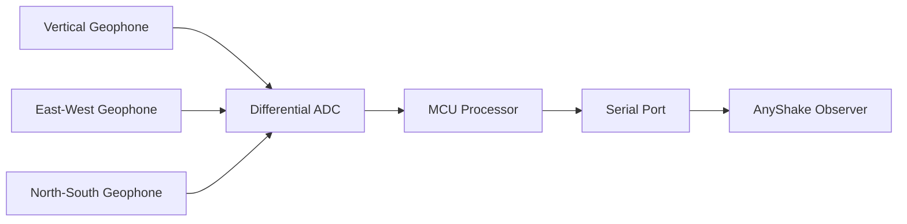

# Quick Start Guide

## Install KiCAD

Download and install [KiCAD](https://kicad.org/).

**Please make sure the KiCAD version is at least `9.0.0` or above.**

## Clone Repository

Clone this repository to your local machine with `--depth=1` option to reduce download size.

```bash
$ git clone --depth=1 https://github.com/anyshake/explorer.git
```

If you don't have git installed, you can download the source code as a `.zip` or `.tar.gz` archive, extract it and `cd` into the directory. However, you will not be able to update the source code with `git pull`.

 - [github.com/anyshake/explorer/archive/refs/heads/master.zip](https://github.com/anyshake/explorer/archive/refs/heads/master.zip)
 - [github.com/anyshake/explorer/archive/refs/heads/master.tar.gz](https://github.com/anyshake/explorer/archive/refs/heads/master.tar.gz)

## Open Project

Open `hardware/Explorer.kicad_pro` with KiCAD to view the project, you can also open `hardware/Explorer.sch` or `hardware/Explorer.kicad_pcb` directly.

**Please note that the project is created with KiCAD `7.0.9`, it may not be compatible with other versions, just ignore the warnings and continue.**

## Diagram

The following diagram shows the hardware architecture of the AnyShake Explorer.



*This diagram is created with [Mermaid](https://mermaid.js.org/), if you can't see it, copy and paste the code block to [Mermaid Live Editor](https://mermaid.live/edit) to view it.*
