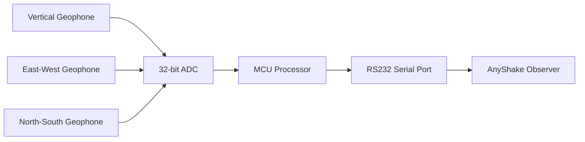

## Diagram

*This diagram is created with [Mermaid](https://mermaid.js.org/), if you can't see it, copy and paste the code block to [Mermaid Live Editor](https://mermaid.live/edit) to view it.*

```mermaid
graph LR
    EHZ[Vertical Geophone] --> B[32-bit ADC]
    EHE[East-West Geophone] --> B[32-bit ADC]
    EHN[North-South Geophone] --> B[32-bit ADC]
    B --> C[MCU Processor]
    C --> D[RS232 Serial Port]
    D --> E[AnyShake Observer]
```

## TODO

 - [ ] Support ADC self-calibration
 - [ ] Support geophone compensation
 - [ ] Replace ESP8266 with STM32F103C8T6
